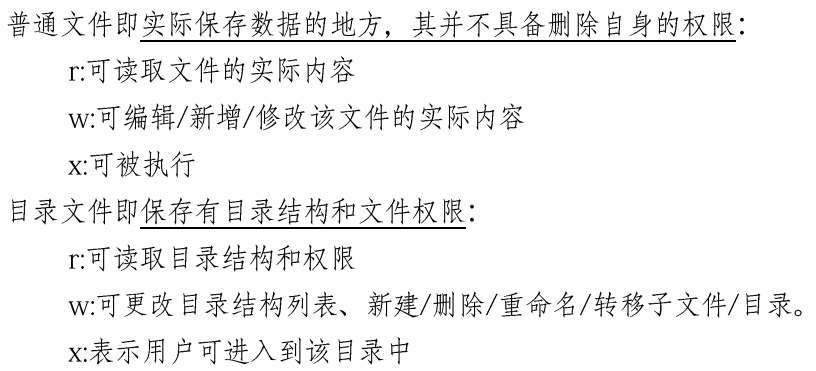
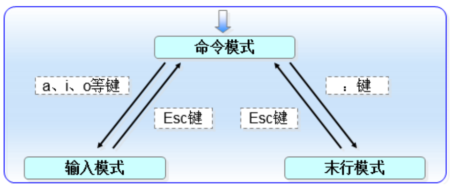
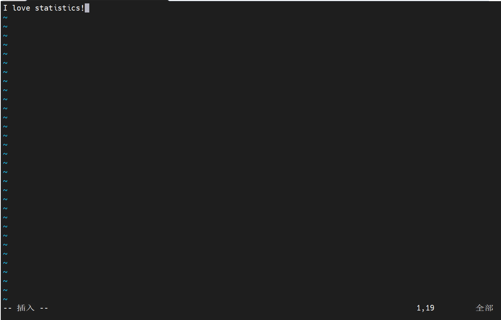
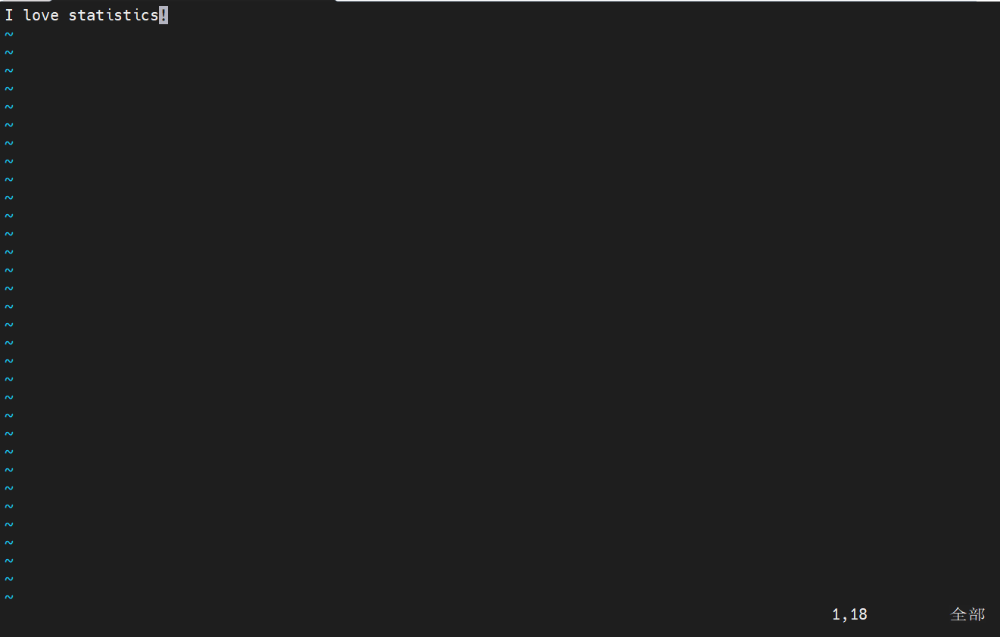
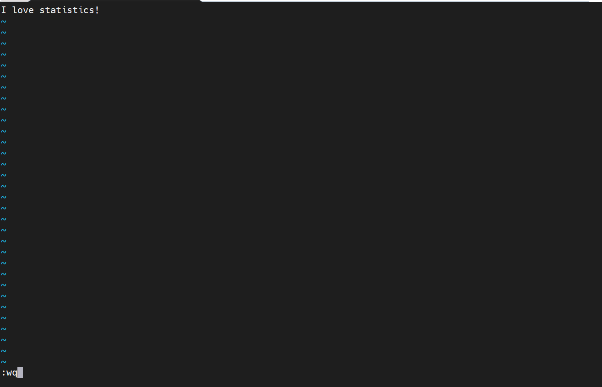

# 2 Linux系统基本知识

虽然同学们使用服务器的主要目的是提交程序运行，但是因为服务器是基于Linux系统，所以在学习如何使用服务器提交程序之前，我们**首先需要了解Linux系统的基本知识**。本节我们将从**工作目录**、**文件管理**和**文本编辑器**三方面介绍Linux系统最常见的命令，方便同学们使用。

## 2.1 工作目录

在Linux系统中，用户主要以**命令行**进行工作目录（或文件夹）的管理，常见命令主要包括**创建**、**查看**、**切换**和**删除**四个模块。

| **命令** | **功能** |
| --- | --- |
| `mkdir 目录名称` | 创建工作目录 |
| `pwd` | 查看当前所在的工作目录 |
| `cd 绝对路径` | 切换工作目录 |
| `cd ./相对路径` | 切换工作目录 |
| `cd ..` | 返回上级目录 |
| `cd ~`或`cd` | 返回家目录 |
| `rmdir 目录名称` | 删除工作目录 |

## 2.2 文件
### 2.2.1 文件认识

在介绍文件管理的相关命令之前，我们**首先了解文件类型和文件权限及归属**。在Linux系统中，常见的两种文件类型是**普通文件**（用-表示）和**目录文件**（用d表示），它们都规定了文件的所有者、所有组以及其他用户对文件所拥有的**可读、可写、可执行**等权限，具体解释见图。

文件的读、写、执行权限简写为**r、w、x**，也可以用**数字4、2、1**来表示，注意文件所有者、所属组以及其他用户权限之间是相互独立的，如表所示。

**注**

如果数字为7，则代表可读、可写、可执行（4+2+1），若数字为6则代表可读、可写（4+2），等等。一个文件的权限为777，则代表这个文件对于文件所有者、文件所属组和其它用户均具备可读、可写、可执行的权限。

在Linux系统中，当我们使用`ls -l`命令查看文件信息时，便可以看到上述介绍的文件类型和文件权限。

### 2.2.2 文件管理命令（附示例）

对于文件的管理，Linux系统也有一系列的命令，常见命令主要包括**查看**、**删除**、**修改权限**等。

| **命令** | **功能** |
| --- | --- |
| `ls` | 显示当前目录的所有文件和子目录 |
| `ls -l` | 显示当前目录的所有文件和子目录的详细信息（包括使用权限、创建日期、大小等） |
| `ls *.R`  | 查看当前目录中文件名以.R结尾的文件 |
| `rm 文件名` | 删除当前目录下的某个文件 |
| `rm *.R`  | 删除当前目录中文件名.R结尾的文件 |
| `cat 文件名` | 查看当前目录下某个文件的文本内容 |
| `chmod 数字组合 文件名` | 修改文件或目录的权限 |

**示例** 

（1）首先进入**test**工作目录，使用`ls -l`命令输出该目录下的所有文件和子目录的信息。

（2）对**test1.R**文件增加所有者可执行（可执行对应数字1，所以第一个数字改为7即可）的权限。

（3）对**test1.R**文件开放所有权限。

（4）删除**test1.R**文件。

## 2.3 文本编辑器

类似于Windows系统的记事本，Linux也有自己的文本编辑器。

**提醒**  对于Windowx记事本创建的文本文件，不可以将其拖到linux系统中直接使用（编码格式不一样）。

在Linux系统中，常用的文本编辑器是**Vim（Vi的升级版）/Vi编辑器**，它设置了三种模式——**命令模式**、**编辑模式**和**末行模式**，这三种模式通过对应的按键（如图）进行相互切换。

- **命令模式**：控制光标移动，可对文本进行复制、粘贴、删除和查找等工作，但无法插入新内容
- **编辑模式**：可以进行正常的文本插入
- **末行模式**：保存或退出文档，以及设置编辑环境

**操作**  在每次运行Vim编辑器时，默认进入命令模式。此时需要按`i`或`a`等切换到输入模式，此时可以进行正常的文本编写工作，编写完成后按`ESC`重新返回命令模式，最后按`:`进入末行模式（显示在编辑器的最下面）执行保存`w`或保存退出`wq`操作。

**示例**

（1）创建一个名为test的文本文件，回车进入编辑器窗口。

（2）按`i`或`a`等切换到输入模式（此时最下面会显示--插入--），输入文本“I love statistics!“。

（3）输入完成后按`ESC`重新返回命令模式，此时最下面的--插入--字样消失。

（4）按`:`进入末行模式（显示在编辑器的最下面），并输入`wq`，回车，执行保存退出。

（5）可以使用`cat`命令查看文本文件的内容。

